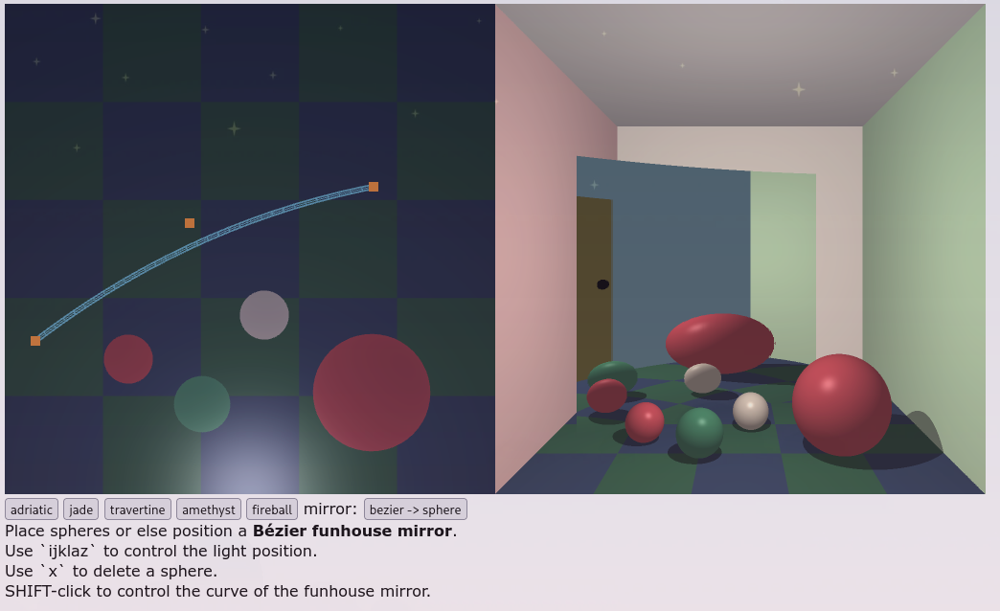
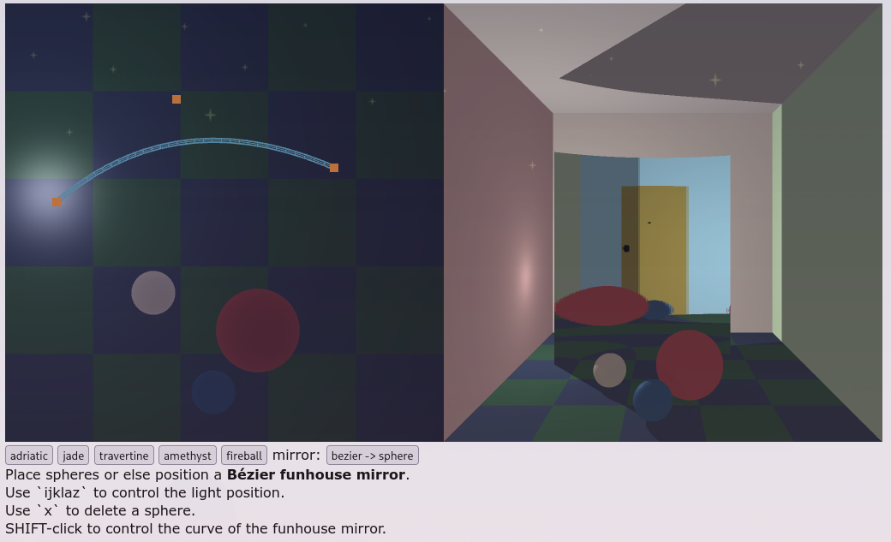

Slerping works:

There is still some significant issue with discontinuities. Either my slerping
is not accurate enough, or more subdivisions are needed.

The mirror's shadow also works, though it's very binary, and so it doesn't look
great:

