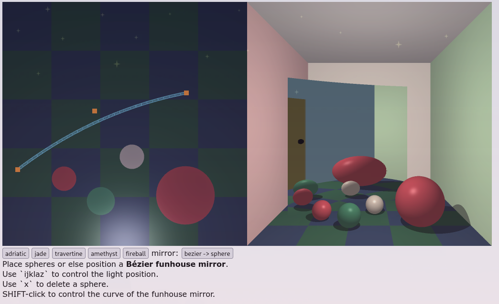
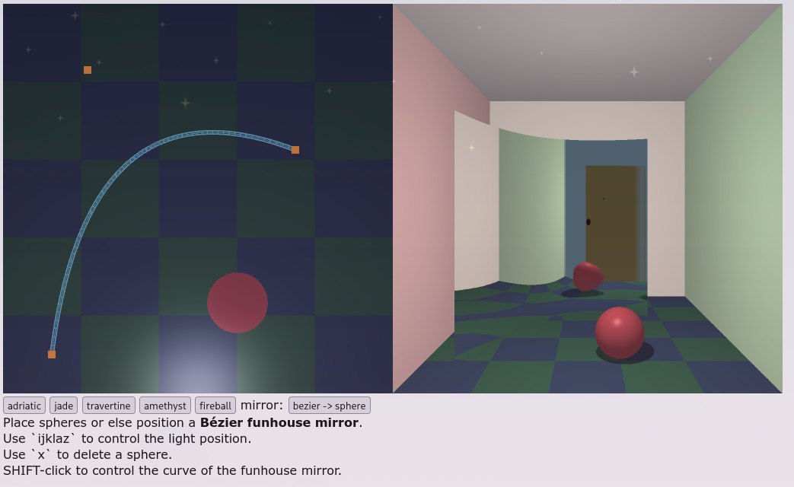
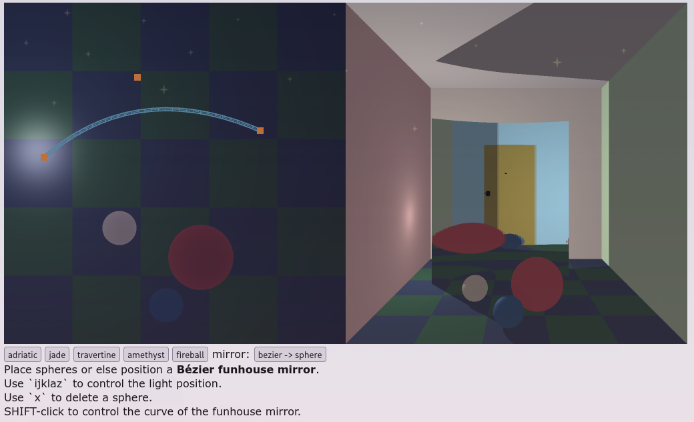
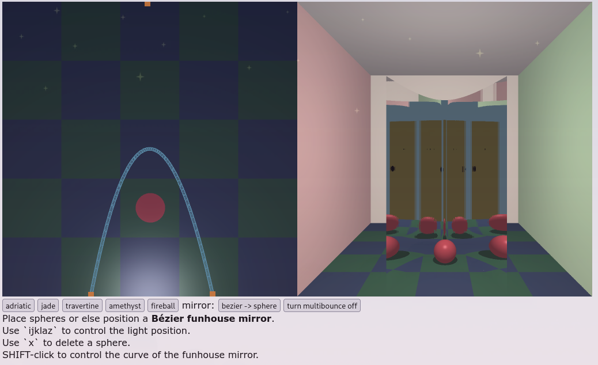
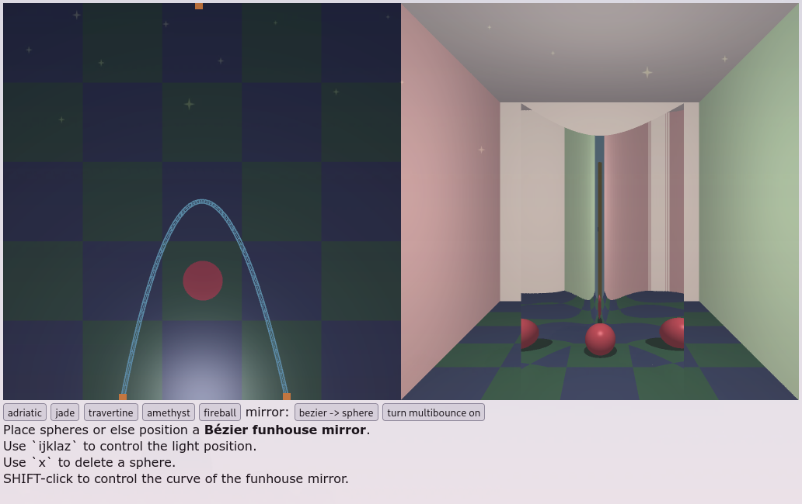

## Running

I mostly am pretty happy with this code. The major outstanding issue is some
discontinuties in the normals; it's unclear if this is a correctness issue on my
part or if the subdivision scheme is just not precise enough to get this right;
there are a few more details below.

There are some performance issues on my machine (which is not the best,
especially GPU wise), especially to do with compiling the shader. Just a warning
to expect that to take a little while.

## Basics

Slerping works, mostly. It's certainly better than without interpolation:

There is still some issue with discontinuities. Either my slerping is not
accurate enough, or more subdivisions are needed. Here's a picture with a more
extreme curve which demonstrates this:

It's totally possible there's a numerical error in my code somewhere. However, I
think this could also be just an issue with the granularity of this subdivision
scheme; similar discontinuities (in particular slight square-ish-ness of
reflections of spheres) seem to exist in the example photo.

The mirror's shadow also works, though it's very binary, and so it doesn't look
great:

## Extras

There's an optional toggle for multibounce:

Here's no multibounce, for comparison:

This seems to work, mostly. The major issue is likely not with this code.
Instead, the discontinuities from slerping (whether because of a numerical error
in my code or insufficient subdivision depth) become significantly more
noticeable when multibounce is enabled; presumably this is because the effect is
cumulative.
